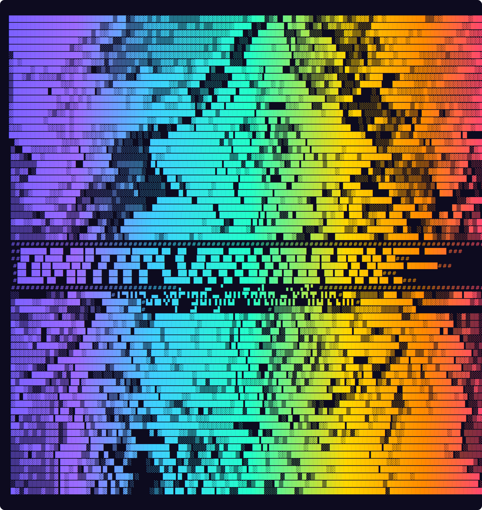
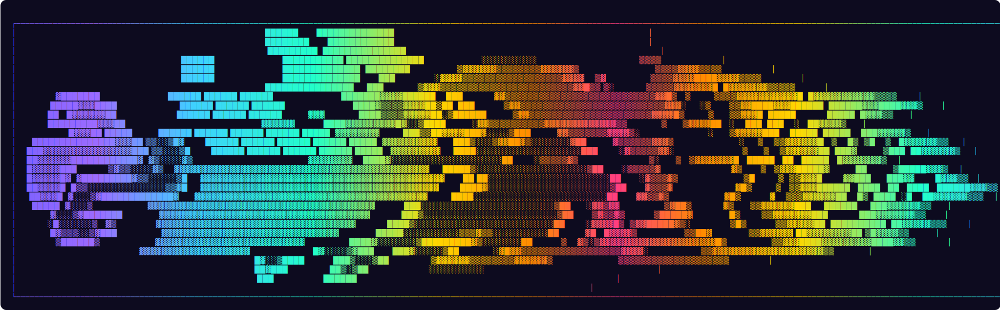

<!-- Header ASCII -->

  

<h3 align="center">Hi, I'm Dmitry 👨‍💻</h3>

Java Developer from Ukraine 🇺🇦 | Exploring Spring Boot, Python & ML 🚀

### 🚀 Tech Stack

  

---

### 🌐 Connect with Me

  
  
  

---

### 🔥 About Me
- 🏢 Currently working at **NextCode.tech**  
- 🌱 Learning **Java, Spring Boot, Python, Machine Learning**  
- ⚡ Passionate about **backend, distributed systems & AI**  
- 💻 Building **IntelliJ plugins** and fun side projects  

---

  

